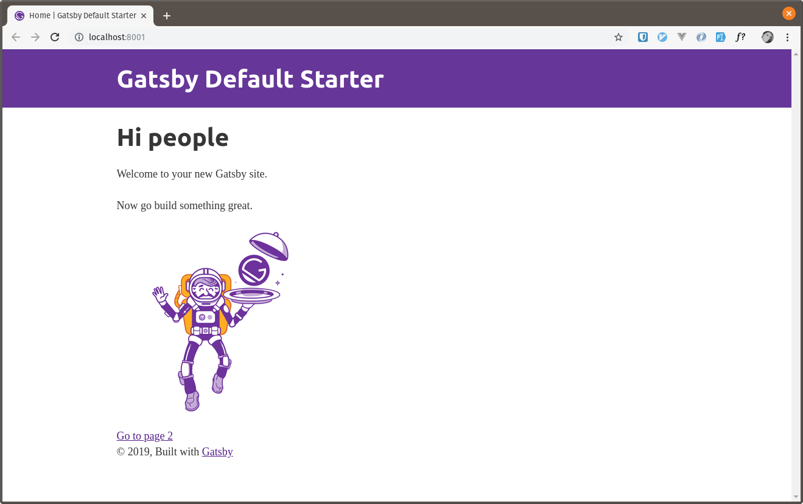
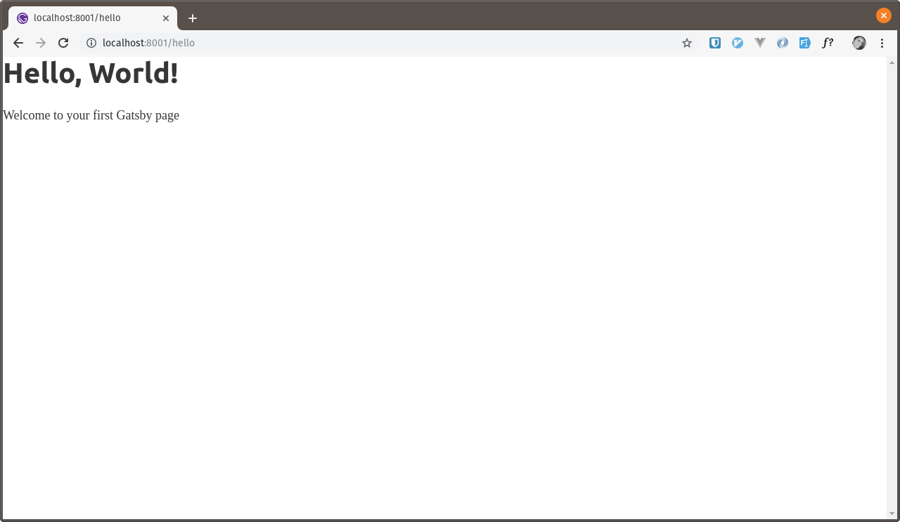

Modern web development is not something that can be picked up particularly quickly, in the current climate of web development there are just a tonne of things we need to learn as developers and this cycle of learning is a big part of every developers life.

We have front-end frameworks such as [vue.js](https://vuejs.org), [react](https://reactjs.org) and [angular](https://angularjs.org), as well as [webpack](https://webpack.js.org) for creating our development and production builds, [es6](https://es6.io) and [babel](https://babeljs.io) also need to be considered in most modern apps as well as CSS pre-processing with tools like [PostCSS](https://postcss.org) and [tailwindcss](https://tailwindcss.com/).

On top of all this we also need to consider the back-end to support these applications such as [Node.js](https://nodejs.org/), [Laravel](https://laravel.com/), APIs, database schema's, deployment strategies, development environments, CDNs ... whew! just an absolute tonne of stuff.

## What is Gatsby?

At a very basic level [Gatsby](https://www.gatsbyjs.org) is a site / app generator which aims to solve all the above problems by having sensible defaults out of the box, however it is a little more than that.

Because what we are generating isn't exactly **static** as such, we are essentially generating a fully working react application that can be hosted anywhere where we can drop JavaScript and HTML, so hosting these applications on services like [Netlify](https://netlify.com) is a trivial task.

Gatsby can also pull in data from various sources at build time, so we will only need that API to be online and available whilst we are building our site, this will then result in a site build containing just HTML, CSS and JavaScript with all that API data then held in [GraphQL](https://graphql.org/) which is almost like a static data-layer for your website build.

The two big advantages of doing it this way are speed and security, because we are hosting HTML and JavaScript there is no need for your website to be making HTTP requests to and from a server at run-time, this data is just held in GraphQL, for the same reason, there is no real vector for hackers to hurt you as such, sure they could "deface" your site, but all you need to do is create a new build with a single command and redeploy.

So I could write an entire blog post about why Gatsby is interesting, but I think we should get stuck into some coding, so let's get started with the installation procedure.

## Installation

If you've installed any node / npm packages in the past then you'll be right at home here, installing Gatsby is a case of installing it globally on your development machine with a simple npm command. (_you can also install with yarn_)

```shell
npm install -g gatsby-cli
```

This will then give you a gatsby command right inside your shell prompt, you might need to logout of your shell and back in again to be able to see it, but you should be able to access it right away.

To create our first Gatsby site we just need to run the following command.

```shell
gatsby new my-blog
```

Running the above command will create a new directory called my-blog which will then contain your brand new Gatsby website, the next thing we need to do is spin up a local development environment, and luckily this has already been done for us as well!

We simply need to run these next commands and we are up and running ...

```shell
cd my-blog
gatsby develop
```

Gatsby will then start up a web development server with hot reloading included out of the box at http://localhost:8000 out of the box, another nice trick is that it will even reconfigure this for you to another port should 8000 already be taken, nice!

At this point you should be able to browse to your new development URL and see your shiny new Gatsby installation complete with hot reloading whenever you save a file.



## Creating our first page with Gatsby

As with all site generators, the first task we need to take care of is creating our first page, in the app directory structure you will notice a src/pages folder, any .js files that you create in here will be translated into pages, the routing will be taken care of for you, so all you need to worry about is simply creating this file.

Let's have a look at the most basic hello world example for a new page, create a file in this pages directory and call it hello.js

```js
import React from "react"

export default () => (
  <>
    <h1>Hello, World!</h1>
    <p>Welcome to your first Gatsby page</p>
  </>
)
```

At this point, as long as we still have our little development server running, you should see that adding this single file triggers a new build, you will then be able to navigate to http://localhost:8000/hello

With any luck you will then see our glorious new creation born into the world!



As you can see this process was very simple, if you don't know react then you may have some questions about the code that went into creating this page, so lets take a quick look at that.

```js
import React from "react"
```

Since Gatsby is based on react we will be needing the react library, this is included into our project with this single import statement, at this point we don't really need any other dependencies, just react.

```js
export default () => (
  <>
    <h1>Hello, World!</h1>
    <p>Welcome to your first Gatsby page</p>
  </>
)
```

There are a few things happening here, firstly we are exporting the following contents of this block of code so that other parts of our application can use it, think of this as a sort of component, and we are offering the following contents up to be used by Gatsby so it can then render it on the screen.

Next you can see these funny little empty brackets, these are [react fragments](https://reactjs.org/docs/fragments.html), by default we are only allowed to return a single div or element from this function, which means that if we have sibling elements in our content (like we do with the h1 and the p tags) then we need to wrap these into a single div. A traditional way to do this in the past has been to actually use a div to wrap around the content, but the div then ends up in your HTML and provides no semantic purpose.

Using react fragments in this way allows us to wrap our h1 and p tags in this example, but no wrapping div element will be generated in the final HTML build, thus avoiding a _"div soup"_ scenario where we have lots of useless wrapping elements in our code.

## Linking between our pages

One final point I wanted to go over before we put the basics down is to talk about linking between pages, traditionally you may have linked between pages by creating a simple anchor tag on each of your pages, for example.

```html
<a href="/">Home</a>
```

However, there is one problem with this approach we using something like Gatsby, and that is that the above will force a full page reload, so when you click on the link the entire page will reload before showing your content.

Instead, what we want to do is provide the ability for a user to click on the link, and only reloading the part of the app (in this case, the content) that has changed.

This means that our page will reload much faster has it never has to make the http request which would instantly add on a few hundred milliseconds, instead our application will fetch the page it wants to load as a component and swap it in the main content portion of the screen.

Lets take a look at an example of this in action.

```js
import React from "react"
import { Link } from "gatsby"

export default () => (
  <>
    <h1>Hello, World!</h1>
    <p>Welcome to your first Gatsby page</p>
    <Link to="/">Home</Link>
  </>
)
```

As you can see we are simply importing the Link component from Gatsby which is given to us for free, and then we would use it in almost exactly the same way as we would a generic anchor tag except we use the property to instead of href

And that is literally all you need to do to link between pages, now when we click on these links, the pages will be reloaded into our app dynamically and we will not be fetching a new instance of our app from any back-end server, magic!

## Conclusion

So let's take a look of what we have covered in this blog post :-

- What is Gatsby
- What problem is Gatsby trying to solve?
- Installation with Node Package Manager (Yarn would be very similar)
- Running our development environment with hot reloading
- Creating our first page from scratch
- React Fragments
- Linking between pages and why it's better to not reload the full page

Of course there are way more parts to go over, but these are the basics, in later posts I will go over GraphQL, rendering, creating a list of posts, implementing tailwindcss and much more.
