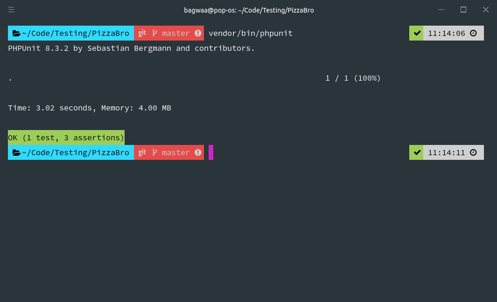
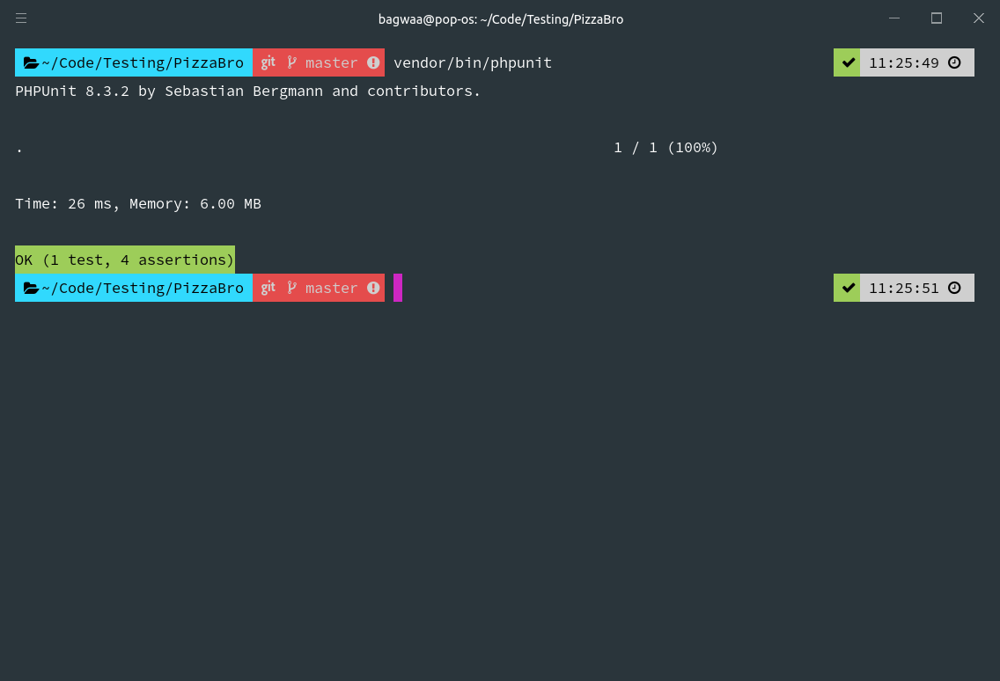

Unit testing is an essential part of development and programming these days, and within the PHP community I think the most widly adopted is probably PHPUnit.

I've seen various testing libraries and frameworks come and go over the years but PHPUnit seems to be the one that resonates most with me and is now pretty much my php unit testing framework of choice.

During that time I have also seen a bunch of mocking frameworks, everything from the standard PHPUnit Mocking Library to Mockery, but my favourite is Prophecy, not only because of its simplicity to use, but also because it now ships as part of PHPUnit itself.

## Dependency Injection

When running our tests, we will often be testing units of code that are dependent on other units of code within a project, these dependencies are usually injected into our classes using dependecy injection which helps testing enourmously, lets take a quick look at what dependency injection looks like in PHP.

```php
// PizzaMaker.php

namespace App;

use App\Repositories\PizzaRepository;

class PizzaMaker
{
    protected $pizzas;

    public function __construct(PizzaRepository $pizzas)
    {
        $this->pizzas = $pizzas;
    }

    public function makePizza(array $toppings) : Pizza
    {
        $pizza = new Pizza($toppings);
        $this->pizzas->save($pizza);

        return $pizza;
    }
}
```

In this example we have a `PizzaMaker` class which is responsible for making `Pizza`, however you will see that when we call `makePizza()` we are creating the new `Pizza` and then passing what we have created into the `save()` method of a `PizzaRepository()`

The `PizzaRepository` class deals with persisting the `Pizza` to the database, and for this reason it has to send a request to a database to store this information.

When we are running our tests, in most cases we want to avoid hitting the database, if we don't then our test suite will becoming reliant on our database connection and will slow down our tests.

This isn't so much of a problem when you have one or two tests, but when you have thousands you could be waiting 20 minutes for your entire test suite to run.

## Hitting the database and services means slower tests

It's possible you're sat there wondering why waiting this long for slow tests is a problem? Well, it's because we want very fast unit tests so that we can have a fast feedback loop in the red, green, refactor cycle.

If you're waiting a long time for tests to pass then you simply won't run them, and you certainly won't adopt TDD to drive out the design of your code.

Let's have a look at the `PizzaRepository` in our example, this is usually the class that is making calls to the database, however in this case we are using `sleep(3)` to simulate a slow call to a database someplace.

_Also, just to note, I know the database wouldn't usually take 3 seconds to save a record, I am just using this as an extreme example of slowing down our test suite so we can see the difference clearly with just one test._

```php
// PizzaRepository.php

namespace App\Repositories;

use App\Pizza;

class PizzaRepository
{
    public function save(Pizza $pizza)
    {
        // Simulate a long running database action for 3 seconds.
        sleep(3);

        $pizza->save();

        return $pizza;
    }
}
```

Next, lets create the best type of pizza in the world and create a simple test to make sure that we can infact create a `Pizza` using the `makePizza()` method on the `PizzaMaker` class.

```php
// PizzaMakerTest.php

use App\PizzaMaker;
use App\Repositories\PizzaRepository;
use PHPUnit\Framework\TestCase;

class PizzaMakerTest extends TestCase
{
    public function test_it_can_create_a_hawaiian_pizza()
    {
        $pizzaMaker = new PizzaMaker(new PizzaRepository);

        $pizza = $pizzaMaker->makePizza([
            'Ham',
            'Pineapple'
        ]);

        $this->assertContains('Ham', $pizza->getToppings());
        $this->assertContains('Pineapple', $pizza->getToppings());
        $this->assertNotContains('Fish', $pizza->getToppings());
    }
}
```

Next, lets run our test suite and make sure everything is working correctly and that our test is actually green.



Yay! it passed! - however there is a big problem with this result, take a look at the time it took to run this test.

```shell
Time: 3.02 seconds, Memory: 4.00 MB
```

Ouch, that one test took a whole `3.02` seconds to run, that's not good.

## What is a mock and why do we need it?

A mock is used when we want to replace a dependency of a class that we are testing, in our example above the test is running so slow because we are calling the `save()` method on the `PizzaRepository` class which contains a `sleep(3)`

We simply need to replace this dependency with a mock, that looks and probably acts the same, but doesn't save anything to the database or have that horrible `sleep(3)` call inside it.

## Creating a mock with Prophecy

All we need todo is create a mock of the `PizzaRepository` dependency and then pass that into our `PizzaMaker` class when we are testing, let's refactor our test a little bit to show how this would look.

```php
// PizzaMakerTest.php

use App\Pizza;
use App\PizzaMaker;
use Prophecy\Argument;
use PHPUnit\Framework\TestCase;
use App\Repositories\PizzaRepository;

class PizzaMakerTest extends TestCase
{
    public function test_it_can_create_a_hawaiian_pizza()
    {
        $repository = $this->prophesize(PizzaRepository::class);

        $repository->save(Argument::type(Pizza::class))
                   ->shouldBeCalledOnce();

        $pizzaMaker = new PizzaMaker($repository->reveal());

        $pizza = $pizzaMaker->makePizza([
            'Ham',
            'Pineapple'
        ]);

        $this->assertContains('Ham', $pizza->getToppings());
        $this->assertContains('Pineapple', $pizza->getToppings());
        $this->assertNotContains('Fish', $pizza->getToppings());
    }
}
```

Before we run the test again to see the results, we have a few things to talk about here since we have added two extra lines of code and modified a third.

On the first line of the test we added :-

```php
$repository = $this->prophesize(PizzaRepository::class);
```

This will create a new mocked instance of `PizzaRepository`, it will look the same, however all the methods on this mocked class will do nothing when called, this includes the slow running `save()` method which will just return `null` in this case.

On the next line we are setting some expectations, we don't care if the `PizzaRepository` actually saves the data, all we care about is that it is asked to save the data in the correct way.

```php
$repository->save(Argument::type(Pizza::class))
           ->shouldBeCalledOnce();
```

This is setting some expected behaviour on our mock, something that we expect will happen to it when we run our tests, if these expectations are not met, then the test will fail.

In this example we are setting the following expectations on the mocked `PizzaRepository` object.

- The `save()` method will be called on `PizzaRepository`
- The `save()` method will be called with an argument which is of the type `Pizza`. (if we tried to pass in an object of type `Taco` for example, it would fail the test)
- The `save()` method will be called once and only once

The final modification to the test we make, and the most important one is to change how we construct our `PizzaMaker` within the test. Since we have been clever programmers in our code and used dependency injection, this is easy.

Previously, we were constructing the `PizzaMaker` as follows :-

```php
$pizzaMaker = new PizzaMaker(new PizzaRepository);
```

We were injecting the real `PizzaRepository` class, perfect for production, but not so good for testing.

Again, one thing to note here, we are not concerned with testing the `PizzaRepository` dependency, that has it's own seperate tests elsewhere, all we are concerned with is testing the `PizzaMaker` class.

Okay, so let's replace the `PizzaRepository` in our test with the mock one we created and set some expectations on earlier.

```php
$pizzaMaker = new PizzaMaker($repository->reveal());
```

Simple! however, you might be wondering what that `->reveal()` call it, we never created that did we? where does that come from?

If we dump out the class type of the `$repository` object without the reveal we see the following :-

```shell
var_dump(get_class($repository));
// string(32) "Prophecy\Prophecy\ObjectProphecy"
```

And lets take a look what we get back when we do exactly the same but adding the `reveal()` call.

```shell
var_dump(get_class($repository->reveal()));
// string(42) "Double\App\Repositories\PizzaRepository\P1"
```

Okay, this is interesting, we have a class of `Double\App\Repositories\PizzaRepository\P1` but where does that fit into everything? what is it?

Let's use the PHP `Reflection` class and do some more digging to see if we can figure out what's happening here.

```php
$repository = $this->prophesize(PizzaRepository::class);

$class = new ReflectionClass($repository->reveal());
$parent = $class->getParentClass()->getName();

var_dump($parent);
// string(32) "App\Repositories\PizzaRepository"
```

Aha! so the parent of the Double is `string(32) "App\Repositories\PizzaRepository"` which is why our `PizzaMaker` is happy to accept this through dependency injection.

Okay, enough of this digging around in the weeds, lets run our test.



See how much faster that is? `26 ms` versus over `3s` when we wern't mocking it.

We have created a mock instance of the `PizzaRepository`, set some expectations that should be called on the `PizzaRepository` and then used `reveal()` to get our mocked version of the `PizzaRepository` which is a child of `PizzaRepository` and then injected that into the `PizzaMaker` with dependency injection.

This is just a really simple example of a mock, we can also create different types of mock classes which I will go into in another post.

## What can we mock?

Foo

## What should we be mocking in ours tests?

Baz

## Should we mock everything then?

Foo

## Other Mocking Libraries

Some examples of syntax

## Do what helps you sleep at night

Foo
