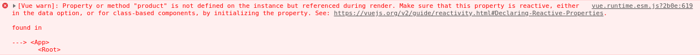

When scoped slots were first introduced to [Vue.js](https://vuejs.org/) I found them quite challenging to fully understand, not so much the syntax but mostly around when and why I would use them.

This is because with scoped slots it's more important to learn the concept over the syntax, so with this in mind lets dig deeper into scoped slots, we'll start with regular slots to make sure we are all on the same page, and then move onto the problems that scoped slots are trying to solve.

_This article covers the new scoped slot syntax using v-slot which was introduced in version 2.6.0, the older syntax using the slot and slot-scope attributes is now deprecated but is currently still available in the framework at the time of posting._

_I will cover the older syntax at the end of this article since it is still widely used by many developers and there are plenty of instances of it in the wild._

`youtube: https://www.youtube.com/watch?v=fauAWw6SVTY`

## What are regular slots?

Let's quickly cover slots and how we use them in Vue, a regular slot is simply a way of passing data into a component, if you know how to use props already then the idea of passing data down into another component should seem pretty familiar, lets look at these two different approaches.

Using props to pass data into a component looks like this from the consumers point of view.

```javascript
<Comment content="Im too old to play Mario Maker 2">
```

Props are great but when you need to pass data into a component that is something other than text or an object, then props tend to become less useful, mostly because passing in html through a prop would quickly turn into an awful sticky mess.

Instead, if we wanted to pass in some html for semantic and styling purposes, then we might use a regular slot in the following way.

```javascript
<template>
  <div id="app">
    <Comment>
      <span class="text-center text-green-400">
        Making levels in Mario Maker 2 is Addictive!
      </span>
    </Comment>
  </div>
</template>

<script>
import Comment from './components/Comment'

export default {
  name: 'app',
  components: {
    Comment
  }
}
</script>
```

In this example above you can see that we are using the regular default slot to pass in not only the text, but we're also passing in an extra wrapping span tag with some [tailwindcss](https://tailwindcss.com/) styles applied.

The content between the opening and closing <Comment> tags is what will be passed down into the child and will replace the `<slot></slot>` tags inside the component.

**The biggest advantage of slots in this scenario is that the consumer of the component can choose how to style the text since they are also responsible for passing in the wrapping span.**

Defining a component with a slot in Vue.js is really simple, let's take a quick look at how we would define this really simple example component now that we've seen how to use it.

```javascript
<template>
  <div>
    <div>the following comment was left</div>
    <slot></slot>
  </div>
</template>

<script>
export default {
  name: 'Comment',
}
</script>
```

I know in this example that the output is largely redundant and pointless, but I am keeping things as simple as possible here just to try and explain the concept and not get bogged down with pages of html or components.

This works great, but we have a problem with the scoping, when we pass anything down into the child component from the parent it is evaluated in the parent, so if we wanted to access a value that was stored in the child component state, then we would be unable to since we would be evaluating all expressions in the parent component only.

I appreciate that may sound a little confusing, so let's look at another example to see this problem occurring.

## What problems are scoped slots trying to solve?

Lets define the problem with a few examples that we can build on, firstly lets create a component for listing out some data that we may have fetched from an API, some kind of `<product-listing>` component.

```javascript
<template>
  <div class="products">
    <h1>A List of Nintendo Games</h1>
    <div>
      <div v-for="product in products" :key="product.id">
        <span class="product_name">{{ product.name }}</span>
        <span class="product_price">{{ product.price }}</span>
      </div>
    </div>
  </div>
</template>

<script>
export default {
  data() {
    return {
      products: [
        { id: 1, name: "Mario Maker 2", rating: 4, price: 40000 },
        { id: 2, name: "Breath of the Wild", rating: 5, price: 60000 },
        { id: 3, name: "Tetris 99", rating: 4, price: 8000 }
      ]
    }
  }
}
</script>
```

Next, lets take a look at the code that would consume this component and how we might use it to display a basic list of Nintendo games.

```javascript
<template>
  <div id="app">
    <product-listing></product-listing>
  </div>
</template>

<script>
import ProductListing from './components/ProductListing'

export default {
  name: 'app',
  components: {
    ProductListing
  }
}
</script>
```

This works okay (ish), however the main problem with this is that we have no way to change what information the child component displays or how it renders it in the browser.

For example, we might decide that as a consumer of this component we want to display the rating of the game, we don't want to change the actual component itself as this behaviour might not always be necessary.

This is where we might reach for a normal slot, lets refactor this example and pass in what we want to display and replace the current static layout with a `<slot>`

```javascript
<template>
  <div class="products">
    <h1>A List of Nintendo Games</h1>
    <div>
      <div v-for="product in products" :key="product.id">
        <slot></slot>
      </div>
    </div>
  </div>
</template>

<script>
export default {
  data() {
    return {
      products: [
        { id: 1, name: "Mario Maker 2", rating: 4, price: 40000 },
        { id: 2, name: "Breath of the Wild", rating: 5, price: 60000 },
        { id: 3, name: "Tetris 99", rating: 4, price: 8000 }
      ]
    }
  }
}
</script>
```

Notice how we have removed the content for the product listing and replaced it with a slot that we want to just drop in, we then might try to consume this component like so.

```javascript
<template>
  <div id="app">
    <product-listing>
      <span class="product_name">{{ product.name }}</span>
      <span class="product_rating">{{ product.rating }}</span>
      <span class="product_price">{{ product.price }}</span>
    </product-listing>
  </div>
</template>

<script>
import ProductListing from './components/ProductListing'

export default {
  name: 'app',
  components: {
    ProductListing
  }
}
</script>
```

When we then call this component from the parent you can see that we are passing in the span tags as well as the data we want to display, notice how we are passing in an extra piece of data we want to display here, the product rating.

As good as this looks, sadly it won't work, if we take a look inside the chrome development tools we will see an error which reads something like this.

> Property or method "product" is not defined on the instance but referenced during render.



The problem here is that in the parent, we are trying to pass down the name, rating and price which are all stored on the product and the parent knows nothing about the data of product because this is scoped to the child component only.

What we need is a way to make the scope of our child component available to our parent component in-between the opening and closing `<product-listing>` tags, and that is exactly what scoped slots provide.

## How to use scoped slots

Lets take a look at the refactored code to make use of scoped slots to get around the problem outlined above, firstly our component needs to make something in it's current scope available to it's parent, in our case this is a product.

```javascript
<template>
  <div class="products">
    <h1>A List of Nintendo Games</h1>
    <div>
      <div v-for="product in products" :key="product.id">
        <slot :product="product"></slot>
      </div>
    </div>
  </div>
</template>

<script>
export default {
  data() {
    return {
      products: [
        { id: 1, name: "Mario Maker 2", rating: 4, price: 40000 },
        { id: 2, name: "Breath of the Wild", rating: 5, price: 60000 },
        { id: 3, name: "Tetris 99", rating: 4, price: 8000 }
      ]
    }
  }
}
</script>
```

The line of most significance here is where we define the actual slot, you'll notice that we have now bound the product to the actual slot tag making it available for our parent to use.

```javascript
<slot :product="product"></slot>
```

This one simple line is essentially offering up something out of the child scope into the parent component if it wishes to use it.

If we want our parent to be able to take advantage of this offering from the child, then we can use the v-slot attribute, lets take a look at our refactored example of the parent.

```javascript
<template>
  <div id="app">
    <product-listing>
      <template v-slot:default="slotProps">
        <span class="product_name">{{ slotProps.product.name }}</span>
        <span class="product_rating">{{ slotProps.product.rating }}</span>
        <span class="product_price">{{ slotProps.product.price }}</span>
      </template>
    </product-listing>
  </div>
</template>

<script>
  import ProductListing from './components/ProductListing'

  export default {
    name: 'app',
    components: {
      ProductListing
    }
  }
</script>
```

In the parent the most significant change is the content that we are passing down to the `<product-listing>` component, we are now using a template tag which will contain the content and the product on the slotScope

One point to note is that template tags are not rendered in the browser but the content will be, we are now accepting the scope that was offered to us from the child component.

```javascript
<template v-slot:default="slotProps">
  <span class="product_name">{{ slotProps.product.name }}</span>
  <span class="product_rating">{{ slotProps.product.rating }}</span>
  <span class="product_price">{{ slotProps.product.price }}</span>
</template>
```

An interesting point to notice here is what the actual scoped content looks like that is offered back to the parent, if we take a look inside slotProps we will see the following :-

```json
{
  "product": {
    "id": 1,
    "name": "Mario Maker 2",
    "rating": 4,
    "price": 40000
  }
}
```

Knowing this we can use JavaScript's destructuring to allow us to just use the product variable name directly and remove the need for showing slotProps everywhere, let's take a look at the final finished example.

```javascript
<template>
  <div class="products">
    <h1>A List of Nintendo Games</h1>
    <div>
      <div v-for="product in products" :key="product.id">
        <slot :product="product"></slot>
      </div>
    </div>
  </div>
</template>

<script>
export default {
  data() {
    return {
      products: [
        { id: 1, name: "Mario Maker 2", rating: 4, price: 40000 },
        { id: 2, name: "Breath of the Wild", rating: 5, price: 60000 },
        { id: 3, name: "Tetris 99", rating: 4, price: 8000 }
      ]
    }
  }
}
</script>
```

```javascript
<template>
  <div id="app">
    <product-listing>
      <template v-slot:default="{ product }">
        <span class="product_name">{{ product.name }}</span>
        <span class="product_rating">{{ product.rating }}</span>
        <span class="product_price">{{ product.price }}</span>
      </template>
    </product-listing>
  </div>
</template>

<script>
import ProductListing from './components/ProductListing'

export default {
  name: 'app',
  components: {
    ProductListing
  }
}
</script>
```

As you can see, in the parent we are now using destructuring to remove that unsightly slotProps naming we had previously.

This concludes the example and hopefully you can see exactly how we used scoped slots to pass the product up to the parent which we can then use to pass in via a slot.

## Why are scoped slots a source of confusion?

On reflection, scope slots were definitely the most difficult concept for me to grasp at the time of learning, I think the difficulty comes from the fact that we are passing scopes up to the parent whilst passing content back down after that scope data has been evaluated in the parent.

The constant back and forth between parent and child just feels a bit odd and it definitely bends the mind a little when learning these concepts.

However, don't be deterred from learning these and getting them solidified in your brain, they are in my mind one of the most important concepts of Vue.js and make the entire framework much more powerful.

## The deprecated syntax of scoped slots

As I mentioned at the top of this article, the syntax we have covered is the new 2.6.0 syntax, however the older syntax is used regularly, infact I am working on a freelance project at the moment which uses scoped slots heavily throughout, and at the moment they are using the old syntax, so lets quickly see that in action.

```javascript
<template>
  <div class="products">
    <h1>A List of Nintendo Games</h1>
    <div>
      <div v-for="product in products" :key="product.id">
        <slot :product="product"></slot>
      </div>
    </div>
  </div>
</template>

<script>
export default {
  data() {
    return {
      products: [
        { id: 1, name: "Mario Maker 2", rating: 4, price: 40000 },
        { id: 2, name: "Breath of the Wild", rating: 5, price: 60000 },
        { id: 3, name: "Tetris 99", rating: 4, price: 8000 }
      ]
    }
  }
}
</script>
```

```javascript
<template>
  <div id="app">
    <product-listing>
      <template slot-scope="{ product }">
        <span class="product_name">{{ product.name }}</span>
        <span class="product_rating">{{ product.rating }}</span>
        <span class="product_price">{{ product.price }}</span>
      </template>
    </product-listing>
  </div>
</template>

<script>
import ProductListing from './components/ProductListing'

export default {
  name: 'app',
  components: {
    ProductListing
  }
}
</script>
```

As you can see, the component is the same, however we are using the slightly more verbose slot-scope attribute on a template tag.

For more information around the reasoning for this change, [take a look at the RFC](https://github.com/vuejs/rfcs/blob/master/active-rfcs/0001-new-slot-syntax.md) which outlines the details of why it was changed.

## Conclusion

This post has been very code heavy, and as I mentioned earlier, scoped slots were easily the most tricky part of learning the framework, but in later blog posts I will show you some examples of some very powerful patterns which utilise scoped slots and you'll see even more examples of how just important they are.
